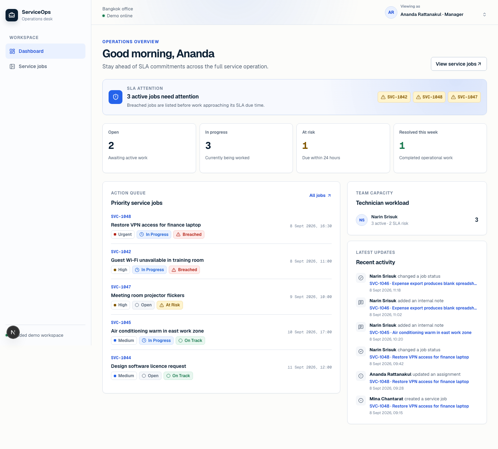
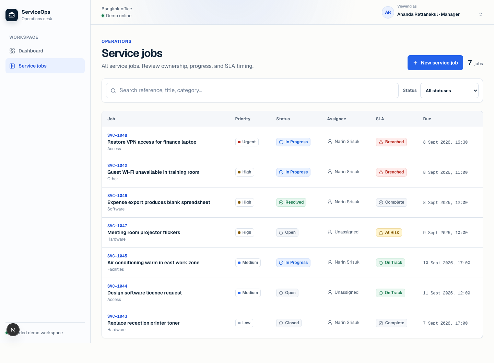
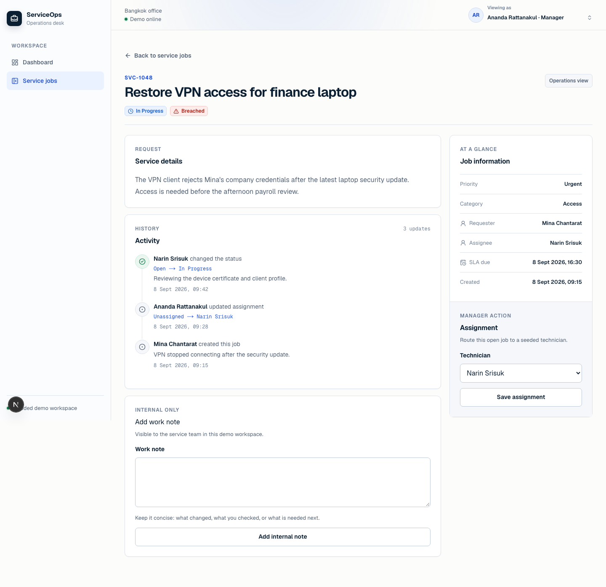
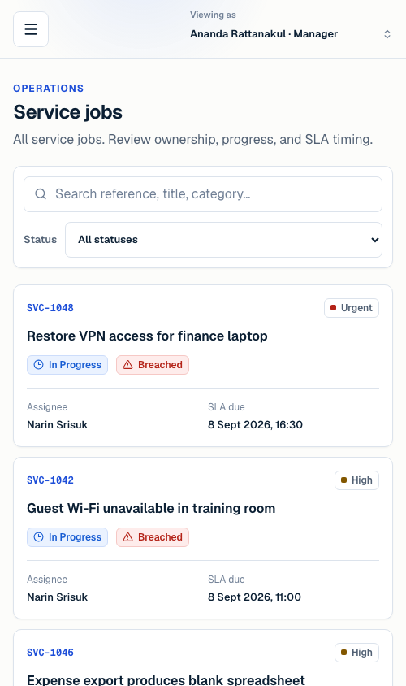
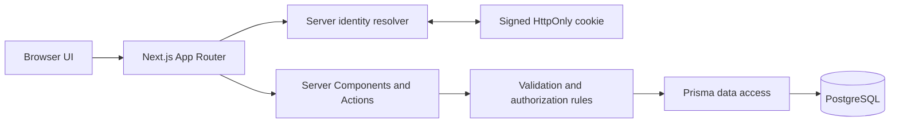

# ServiceOps Desk

[](https://github.com/TheetawatCode/serviceops-desk/actions/workflows/quality-gates.yml)

ServiceOps Desk is a portfolio-scale service-operations application for coordinating internal support jobs. It demonstrates the work expected from a junior frontend or frontend-focused full-stack developer: polished responsive UI, accessible role-aware workflows, trustworthy server authorization, relational data modeling, and automated quality gates.

> **Live Demo:** [Open ServiceOps Desk](https://serviceops-desk.vercel.app). The production demo uses seeded identities and realistic seeded service-job data.

## Product overview

Staff often submit operational requests through chat or spreadsheets, making ownership and deadlines difficult to follow. ServiceOps Desk gives each role a focused view of the same persisted workflow:

- Staff create clear requests and follow only the jobs they submitted.
- Technicians work their assigned queue, update status, and record internal notes.
- Managers see the complete operation, assign work, monitor SLA risk, and close resolved jobs.

The visual system, **Operational Clarity**, combines restrained typography, information-dense working surfaces, and semantic SLA/status treatments without becoming a generic admin template. See [docs/design-direction.md](docs/design-direction.md).

## Screenshots

### Role-aware operational dashboard



### Service job queue



### Job workflow detail



### Responsive mobile queue



## Features by workflow

### Submit and review

- Validated, single-page service job creation for Staff and Managers.
- Server-derived requester identity, initial `OPEN` status, deterministic SLA due time, and atomic `CREATED` activity.
- Role-scoped job queue with search, status filtering, responsive cards, semantic badges, and accessible empty/loading/error states.

### Assign and execute

- Manager assignment and reassignment to seeded Technician identities.
- Explicit Technician actions for `OPEN → IN_PROGRESS → RESOLVED`.
- Internal notes for assigned Technicians and Managers, with server-resolved authorship.
- Atomic status/assignment activity records and immutable closed jobs.

### Monitor and close

- Runtime SLA derivation: `BREACHED`, `AT_RISK`, `ON_TRACK`, or `COMPLETE`.
- Role-aware dashboard summaries, SLA attention strip, actionable queue, and recent activity.
- Manager-only seeded Technician workload aggregation.
- Manager actions for `RESOLVED → CLOSED` or `RESOLVED → IN_PROGRESS`.

## Roles and permissions

| Capability | Staff | Technician | Manager |
| --- | :---: | :---: | :---: |
| View jobs | Submitted only | Assigned only | All |
| Create a job | Yes | No | Yes |
| Assign a Technician | No | No | Non-closed jobs |
| Start or resolve work | No | Assigned jobs | No |
| Return resolved work to progress | No | No | Yes |
| Close resolved work | No | No | Yes |
| Add internal notes | No | Assigned, non-closed jobs | Accessible, non-closed jobs |
| View team workload | No | No | Yes |

The UI hides unavailable controls, while every mutation independently authorizes against the active server-resolved identity.

## Architecture

Next.js Server Components query PostgreSQL directly for read views. Server Actions own job mutations and call framework-independent business rules before Prisma performs atomic writes. A small route handler changes the seeded demo identity by validating the requested ID and setting a signed, `HttpOnly` cookie.



Core boundaries:

- `src/app`: routes, route handlers, and Server Actions.
- `src/components`: responsive application shell and workflow UI.
- `src/lib`: identity resolution, role/SLA rules, dashboard derivation, and Prisma repositories.
- `prisma`: schema, migration, and deterministic demo seed.
- `e2e`: isolated Playwright workflow, accessibility checks, database cleanup, and screenshot capture.

## Technology stack

- Next.js 16 App Router, React 19, and TypeScript
- Tailwind CSS 4 with project-owned Operational Clarity tokens and compositions
- PostgreSQL 17 in Docker, Prisma 7, and the PostgreSQL Prisma adapter
- Vitest and React Testing Library for business rules and UI behavior
- Playwright with Chromium for critical workflow and browser-quality checks
- ESLint and the Next.js production build quality gate
- Deployed on Vercel with Neon PostgreSQL for the portfolio demo

## Local setup

Prerequisites: Node.js 24, pnpm 12, and Docker Desktop.

```bash
cp .env.example .env
# Replace DEMO_COOKIE_SECRET with a local random value of at least 32 characters.

pnpm install
pnpm exec playwright install chromium
docker compose up -d
pnpm db:migrate --name init
pnpm db:seed
pnpm dev
```

Open `http://localhost:3000/dashboard`.

The seed contains three fixed demo identities and seven realistic jobs. It is idempotent: rerunning it restores those records without deleting unrelated local data.

### Quality commands

```bash
pnpm lint
pnpm exec tsc --noEmit
pnpm test
pnpm test:e2e
pnpm exec prisma migrate deploy
pnpm db:seed
pnpm build
```

Playwright starts its own local Next.js server, reseeds before the suite, uses the public demo-identity API and actual UI controls, and removes only `[E2E]`-prefixed jobs during setup/teardown.

## Test coverage

- **Vitest:** signed identity-cookie resolution and rejection, role switcher behavior, SLA boundaries, dashboard scoping/metrics/workload, job creation validation and spoofing prevention, assignment rules, every allowed/rejected status transition, timestamp behavior, closed-job immutability, and note authorship/validation.
- **Playwright:** the full Staff → Manager → Technician → Manager workflow, direct Technician denial from job creation, main-route heading and semantic-label checks, form validation associations, mobile overflow, visible keyboard focus, mobile drawer focus trapping/restoration, and curated screenshot generation.

The tests exercise the portfolio-critical behavior; they are not a claim of exhaustive production coverage.

## Demo and security boundary

This repository intentionally does not include production authentication or user management. The role switcher chooses from three seeded users; the server validates that allowlist, signs the identity into an `HttpOnly`, `SameSite=Lax` cookie, and reloads the user from PostgreSQL for queries and mutations.

This is credible authorization plumbing for a reviewable demo, not a substitute for production sessions, account recovery, CSRF strategy, audit requirements, tenant isolation, or secret management. Never deploy with the example cookie secret or local database credentials.

## Production deployment

ServiceOps Desk is deployed on [Vercel](https://serviceops-desk.vercel.app) with Neon PostgreSQL.

- Production migrations and the deterministic demo seed are applied.
- Vercel stores the production `DATABASE_URL` and a strong, unique `DEMO_COOKIE_SECRET` as environment variables.
- The production smoke test covers all three role views and the critical Staff → Manager → Technician → Manager workflow.

The deployed demo intentionally uses seeded identities and realistic service-job data. Never deploy with the example cookie secret or local database credentials.

Email, SMS, payments, external identity providers, notifications, real-time infrastructure, and third-party product integrations remain explicit non-goals.
